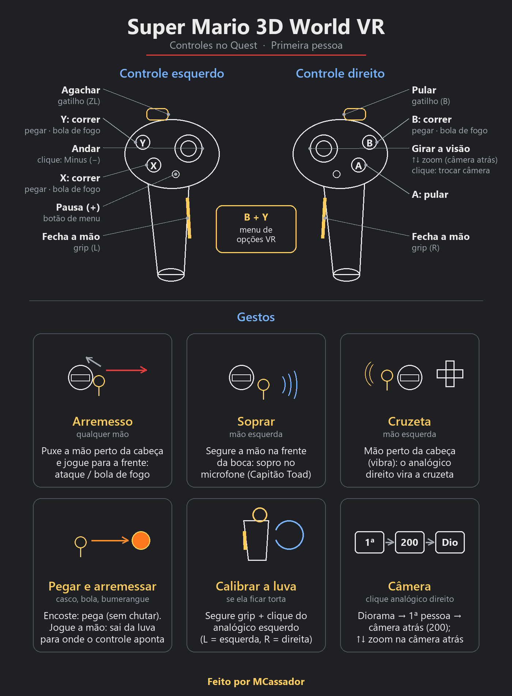

# Super Mario 3D World VR

**Version 1** · Windows x64 · Cemu · OpenXR

Renderização estéreo e rastreamento de cabeça em seis graus de liberdade para a versão de Wii U
de **Super Mario 3D World**. Jogue com um controle (gamepad) no modo diorama ou em primeira pessoa.

[Instalação](INSTALL.md) · [Problemas conhecidos](KNOWN-ISSUES.md) ·
[Créditos](CREDITS.md)

## Escolha um modo

| Modo | Como selecionar | Visão |
| --- | --- | --- |
| **Diorama** | Padrão ao iniciar | Vê a fase como um diorama. |
| **Primeira pessoa** | Clique no analógico direito (R3) | Visão pelo personagem; gira em passos com o analógico direito (veja INSTALL.md). |

Rode `Start-VR.cmd`. Clique **R3** numa fase para trocar de modo sem reiniciar o
Cemu; clique de novo para voltar. Cada troca também reseta o giro da câmera e
recentraliza a posição do headset. A introdução e o mapa do mundo usam a visão diorama.

Os dois modos têm menus e HUD ancorados na sala, rastreamento de cabeça, e o enquadramento
de câmera VR na cinemática de abertura.

## Modificações desta versão (por MCassador)

Feito por **MCassador**. Tudo está descrito em detalhe, com os
números e interruptores exatos, em [INSTALL.md](INSTALL.md); resumo:

- **Mãos e luvas em primeira pessoa:** as luvas do próprio personagem aparecem na posição e
  giro dos controles, em vez de esconder o corpo inteiro; funcionam para Mario, Luigi, Toad,
  Peach e Rosalina (a Peach e a Rosalina listam a saia primeiro na lista de partes do jogo, o
  que antes fazia a luva errada aparecer). Inclui: deslocamento das luvas para a frente,
  predição de posição (a luva não fica atrasada numa mão rápida), calibração do giro por
  gestos (segurar o grip + clicar o analógico por cerca de um terço de segundo - de
  propósito, não um toque rápido, depois que um instante só chegou a desviar a luva sem
  querer durante o jogo normal), e tamanho ajustável por personagem (Peach e Rosalina tinham
  a mão bem menor que o Mario e agora ficam do mesmo tamanho).
- **Bola de fogo:** sai da palma da luva direita (não do pulso), inclusive antes da checagem
  de parede do próprio jogo, e voa na direção para onde o controle direito aponta (só no plano
  do chão por padrão, para não jogar no chão com a mão baixa). Só funciona na primeira pessoa
  original, com o controle direito rastreado.
- **Pegar e arremessar com a mão:** segurando o grip e encostando num casco de Koopa (bola de
  beisebol, bola de neve, bomba, inimigos), o Mario pega; ele fica na mão do grip, pendurado abaixo
  e ao lado dela para não tapar a visão. Com os dois grips fica entre as mãos; pegando com o outro
  grip e soltando o primeiro, passa de uma mão para a outra. Soltar os grips (ou o gesto da mão)
  arremessa, reto para onde você olha. Vale para todas as formas (pequeno, grande, gato...);
  distância e altura ajustáveis no menu.
- **Mãos que fecham:** segurando o grip a luva fecha o punho; só o gatilho, a mão fica meio fechada;
  sem nada, a luva faz a pose do próprio jogo.
- **Ajuda na primeira pessoa:** encostar num casco não chuta mais, a sombra fica maior e mais
  escura e, ao cair, o Mario é guiado de leve para o inimigo embaixo dele, para acertar o pisão
  (também na câmera 200; sem segundo pulo sozinho; vibra quando age; opcional no menu).
- **Bumerangue e mergulho do gato pela mão:** o bumerangue sai da luva direita e voa para onde o
  controle direito aponta; o mergulho do gato vai na direção do controle direito.
- **Gesto de ataque ("arremesso de pesca"):** puxar qualquer uma das mãos para perto da cabeça e
  depois jogá-la para a frente aciona o ataque (bola de fogo, arranhão do gato), sem precisar de
  botão.
- **Gesto de soprar:** levar a mão esquerda perto da boca é interpretado como um sopro no
  microfone do GamePad (fases do Capitão Toad, inimigos e objetos que reagem a som).
- **Câmera:** limites de giro da câmera do diorama mais largos (a câmera não trava mais de um
  lado em vários casos), câmera das cutscenes mais afastada, e uma segunda distância de câmera
  em primeira pessoa (200) em que o analógico direito para trás/frente afasta ou aproxima a
  câmera (para cima, não para baixo) e mostra o corpo e as mãos normais; o passo intermediário
  de 160 foi removido (agora é só primeira pessoa original → 200 → diorama).
- **Corpo na primeira pessoa:** olhando para baixo aparece o corpo do personagem (sem a
  cabeça), virado para onde você girou com o analógico, com os braços indo do ombro até as
  luvas do VR e, na Peach e na Rosalina, a saia. O corpo acompanha a câmera quando você a
  afasta, e a altura dos olhos segue o tamanho de cada personagem (Toad baixo, Peach alta).
- **Andar para onde olha:** em primeira pessoa, empurrar o analógico para frente anda para onde a
  cabeça olha, 1:1 (o "imã" do jogo que endireita o analógico fica desligado na primeira pessoa);
  no menu dá para trocar para onde o controle direito aponta (com sensibilidade ajustável) ou
  para o jeito do jogo.
- **Horizonte nivelado (decoupled pitch):** na escolha de fases, nas fases vistas de cima e nas
  cenas, a câmera do jogo fica nivelada (mesmo lugar e direção, sem inclinar para baixo); você
  olha para baixo com a cabeça. Opcional no menu.
- **Ajuste das luvas:** no menu, esferas de arame desenhadas nos controles reais mostram onde eles
  estão; inclinação, giro e distância das luvas ajustam para a luva ficar em cima do controle.
- **Vibração:** quando o jogo faria o GamePad vibrar (dano, pulo, pisão, bloco), os dois controles
  do Quest vibram, com força ajustável no menu.
- **Conforto:** vinheta ao andar, agachar de verdade (abaixar o corpo faz o Mario agachar), cenas
  do jogo numa tela fixa e mira no pulo em primeira pessoa (puxa de leve para cima do inimigo e
  vibra quando age) - tudo opcional no menu.
- **Menu de opções no óculos (B + Y):** apertando B e Y juntos abre um menu na sua frente para
  ligar/desligar e ajustar o corpo, os braços, o giro, as distâncias de câmera e o
  tamanho das luvas, sem editar arquivos; fica salvo para as próximas vezes.
- **Diagnóstico:** ao fechar o Cemu, o launcher mostra quantos quadros e passos de jogo por
  segundo a sessão teve (`Speed:`), e novas linhas `Fireball:` e `Blow:` com números sobre a
  bola de fogo e o gesto de soprar, para ajudar a entender o que não funcionou. Tudo também
  fica salvo em `session-logs`.
- **Correção do travamento do jogo e mais 3 bugs achados numa revisão de código:** a camada VR
  (`cemuvr_layer.dll`) parava de publicar a posição da cabeça depois de cerca de 65.535 pares
  de pose (~9 min a 120 FPS) e travava o rastreamento; uma falha passageira podia desligar o
  VR pelo resto da sessão; o HUD podia ficar preso a um dispositivo gráfico antigo depois de
  redimensionar a janela; e uma espera sem limite podia travar a thread de renderização do
  Cemu. As quatro foram corrigidas diretamente no código-fonte C++ e recompiladas (não são
  mais remendos no binário) - veja KNOWN-ISSUES.md.
- **Correção de passos perdidos:** o pacote de FPS descartava tempo sobrando quando os quadros
  eram desiguais, deixando o jogo em câmera lenta a ~70 quadros por segundo; agora aproveita
  esse tempo sobrando no quadro seguinte.

Veja as [notas de lançamento](RELEASE_NOTES.md) para o histórico da base VR e
[INSTALL.md](INSTALL.md) para os controles e todos os interruptores das modificações
acima. Iluminação, sombras e efeitos de profundidade ainda têm limitações; veja
[problemas conhecidos](KNOWN-ISSUES.md).

## Para começar

1. Baixe o **ZIP de instalação da Version 1** em [Releases](../../releases).
2. Coloque a pasta `Mario3DWorld-VR` ao lado do `Cemu.exe`.
3. Feche o Cemu e rode `Start-VR.cmd`.
4. Abra Super Mario 3D World no Cemu e jogue com o gamepad ou com os controles VR.

Use o ZIP de instalação para jogar. O **Code → Download ZIP** deste repositório tem os mesmos
arquivos, já prontos (não precisa compilar): só renomeie a pasta extraída para `Mario3DWorld-VR`.

Veja [INSTALL.md](INSTALL.md) para configurar o headset, opções gráficas e de FPS.

## Requisitos

| Componente | Configuração suportada / testada |
| --- | --- |
| Sistema | Windows x64 |
| Emulador | Cemu **2.6**, renderizador Vulkan |
| Jogo | Base europeia de Wii U **v0**, sem atualização |
| Identificadores do jogo | Title ID `0005000010145D00` · checksum do módulo `D2308838` |
| VR | Um runtime OpenXR ativo para o headset |
| Entrada | Um gamepad configurado ou controles VR OpenXR suportados; o controle emulado 1 precisa ser um Wii U GamePad |

Os testes de headset usaram uma RTX 4080 e uma AMD RX 9060 XT, e Virtual Desktop/VDXR a
120 Hz. Outros hardwares, runtimes e versões do jogo não foram validados.
Cemu e o jogo não estão incluídos.

## Controles

| Entrada | Ação |
| --- | --- |
| Movimento da cabeça | Olhar ao redor e mover o ponto de vista em VR |
| Gamepad | Controles normais do jogo |
| Clique no analógico direito (R3) | Trocar Diorama / Primeira pessoa, resetar o giro da câmera e recentralizar a cabeça |
| Analógico direito esquerda/direita, primeira pessoa | Gira um passo por vez |
| Analógico esquerdo, primeira pessoa | Move em relação à visão já girada |
| B + Y juntos (controles do Quest) | Abre/fecha o menu de opções VR |

Para os controles VR e os botões alternativos de troca de modo, veja
[INSTALL.md](INSTALL.md#controles).

O HUD fica fixo na sala enquanto você gira a cabeça. O rastreamento de cabeça é
independente do giro pelo analógico.

## Taxa de quadros

O preset padrão busca **120 pares estéreo renderizados por segundo** mantendo as
atualizações de jogo perto de **60 Hz**. Ele não interpola o movimento do personagem
entre as atualizações de jogo. A taxa real depende do seu sistema.

Há um preset de referência de 60 FPS; 90 e 144 FPS são experimentais.

## Status

Este é um lançamento inicial e incompleto. Uma jogatina completa ainda não foi
validada. O comportamento de câmera, visibilidade, efeitos e transições de cena ainda
podem ter problemas, principalmente em primeira pessoa. Veja [KNOWN-ISSUES.md](KNOWN-ISSUES.md)
para as limitações e o que incluir num relato de problema.

## Créditos e licença

Feito por **MCassador**. Veja [CREDITS.md](CREDITS.md).

Partes do código vêm de projetos com licença livre (MIT / Apache 2.0), cujos avisos acompanham
o pacote: [LICENSE](LICENSE), [licenses/](licenses/) e [THIRD-PARTY.txt](THIRD-PARTY.txt).

## Projeto não oficial

Este projeto não é afiliado nem endossado pela Nintendo, pelo Cemu ou pelo BetterVR.
Nomes de jogos, personagens e recursos pertencem aos seus respectivos detentores de
direitos. Cada usuário precisa fornecer seu próprio jogo obtido legalmente. O pacote não
contém dump do jogo, chaves, firmware, saves ou recursos extraídos do jogo.
